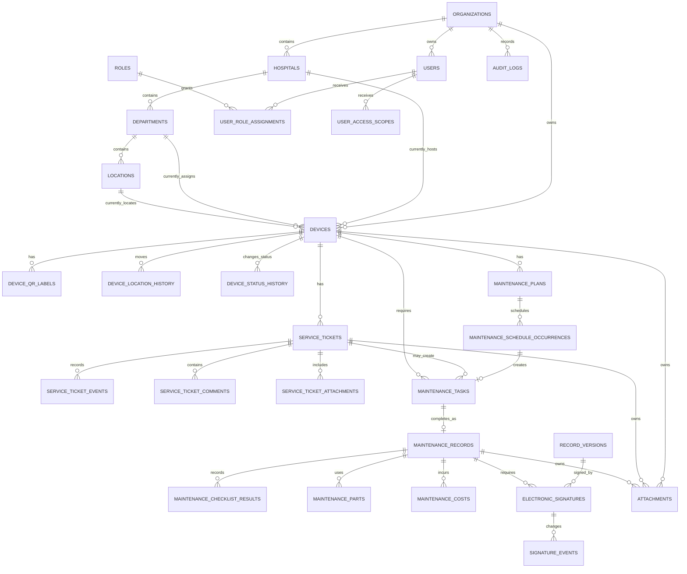

# BEMMS Database Schema and Entity-Relationship Design

> **Documentation navigation:** [Developer start here](BEMMS-Documentation-Index.md) · [Core product vision](<BEMMS- main-idea.md>) · [Application modules](BEMMS-Application-Modules-and-Pages.md) · [Role-based UX](BEMMS-Role-Based-User-Experience-and-Workflows.md) · [Permissions and state machines](BEMMS-Permissions-and-State-Machines.md)
>
> **Related domain specifications:** [QR helpdesk](QR-Helpdesk-Ticketing-Workflow.md) · [Maintenance triage](BEMMS-Maintenance-Types-and-Engineer-Triage.md) · [PM scheduling](BEMMS-Preventive-Maintenance-Scheduling-and-Alerts.md) · [Electronic signatures](BEMMS-Electronic-Signatures-and-Traceability.md) · [Administration](BEMMS-Administration-Settings-and-User-Management.md) · [Department inventory](BEMMS-Department-Device-Management-and-Inventory.md)

## 1. Purpose

This document is the PostgreSQL implementation blueprint for BEMMS. It defines the canonical entities, logical tables, relationships, data ownership, constraints, indexes, audit rules, transactions, and migration sequence needed to implement BEMMS as a self-hosted multi-user system.

It is a schema design specification, not a ready-to-run SQL migration. The implementation may use an ORM or SQL migrations, but it must preserve the relationships, integrity rules, history, and access boundaries described here.

The central design principle is:

> **One physical device has one trusted current profile and many immutable historical events: tickets, tasks, maintenance records, status/location changes, signatures, documents, and audit entries.**

---

## 2. Database Platform and Conventions

### 2.1 Database Platform

* Production database: self-hosted PostgreSQL.
* Development-only option: SQLite may be used for limited prototypes/tests, but it is not the production schema target.
* PostgreSQL is the system of record. Redis/BullMQ, if added, is for queues/cache/notifications only and must not be the sole persistent store for BEMMS data.

### 2.2 Naming Convention

Use lowercase `snake_case` plural table names:

```text
devices
service_tickets
maintenance_tasks
electronic_signatures
```

Use singular foreign-key names:

```text
device_id
organization_id
assigned_user_id
```

Use the canonical ticket terms throughout implementation:

```text
service_tickets
service_ticket_comments
service_ticket_events
service_ticket_attachments
```

`issue_reports`, `issue_comments`, and `issue_attachments` are deprecated names and must not be used in new schema, API, or application code.

### 2.3 Primary Keys and External References

* Use `uuid` primary keys for core entity records.
* Generate UUIDs on the server/database using an approved UUID function.
* Use human-readable numbers separately for staff-facing records, such as `BEM-2026-00482`, `PM-2026-0081`, and `CM-2026-0134`.
* Human-readable numbers are unique within their configured organization/sequence scope but are never used as foreign keys.
* QR codes use opaque stable references, not exposed sequential IDs.

### 2.4 Time and Dates

* Store event timestamps in UTC as `timestamptz`.
* Store date-only PM/calibration due dates as `date` when a time of day is not meaningful.
* Store organization/hospital timezone as an IANA timezone name, such as `Africa/Cairo`.
* Calculate due/overdue and alert boundaries in the applicable hospital timezone, while preserving UTC event timestamps.

### 2.5 Standard Audit Fields

Mutable business records normally include:

```text
id
organization_id
created_at
created_by_user_id
updated_at
updated_by_user_id
archived_at
archived_by_user_id
archive_reason
```

Append-only history/audit/signature/event records instead include immutable creator/time fields and must not support ordinary update/delete operations.

### 2.6 Archive Rather Than Delete

Real hospital records are archived/deactivated, not permanently deleted. Tables with workflow, signature, maintenance, ticket, document, or audit history must never be casually hard-deleted.

Permanent deletion is allowed only for an authorized, clearly erroneous empty record with no linked history. The application must enforce this through a controlled action and audit event.

---

## 3. Data Ownership and Source-of-Truth Rules

### 3.1 Current Profile Versus Historical Evidence

| Data | Canonical source | How it is used |
|---|---|---|
| Current device location | `devices` current assignment fields | Fast device profile/list/filter display. |
| Location history | `device_location_history` | Historical traceability and transfer audit. |
| Current device status | `devices.current_status_code` | Current availability banner/filtering. |
| Status history | `device_status_history` | Traceability, downtime, and release history. |
| Ticket progress | `service_tickets` plus `service_ticket_events` | Current queue state and ticket timeline. |
| Active maintenance work | `maintenance_tasks` | Assignment/work queue and current execution stage. |
| Official completed work | `maintenance_records` plus signatures | Signed technical evidence and device history. |
| Official last PM/calibration summary | Derived from latest qualifying signed `maintenance_records` plus active plan | Displayed on the device profile; not manually typed. |
| User access | `user_role_assignments` and `user_access_scopes` | Server-side authorization evaluation. |
| Configuration/policy | Versioned policy/template tables | Effective rule at action time. |
| Audit trail | `audit_logs`, event tables, and signature events | Append-only accountability evidence. |

### 3.2 Derived Device Summary Fields

The `devices` table may store cached/derived summary fields for fast list performance, for example:

```text
last_maintenance_record_id
last_maintenance_completed_at
next_pm_due_date
last_calibration_record_id
calibration_expires_on
```

These fields must be updated only by trusted server-side transactional services. Their canonical evidence remains the qualifying maintenance plan/record/signature chain. A user must never manually type a false `last maintenance` value into the device profile.

### 3.3 Snapshot Data

Tickets, tasks, records, and history events retain selected snapshots of device location, reporter contact, role, policy, checklist, and document metadata at the time of action. Snapshots preserve historical meaning when a device/user/department later changes.

Use normalized foreign keys for relationships and snapshot columns/JSON for immutable historical context. Do not use JSON as a substitute for relational tables where filtering, referential integrity, or reporting is required.

---

## 4. Logical Entity-Relationship Diagram



The diagram is a logical model. Actual SQL schema can use junction tables where an entity has multiple attachments, tasks, documents, roles, or access scopes.

---

## 5. Domain A: Organization, Hospitals, Departments, and Locations

### 5.1 `organizations`

One tenant/organization that owns hospitals, users, devices, policies, and data.

| Column | Type | Rules |
|---|---|---|
| `id` | `uuid` | Primary key. |
| `name` | `text` | Required. |
| `code` | `text` | Required; unique per platform/tenant policy. |
| `default_timezone` | `text` | Required IANA timezone. |
| `status` | enum/text | `active`, `inactive`, `archived`. |
| standard audit/archive fields | mixed | See section 2.5. |

### 5.2 `hospitals`

| Column | Type | Rules |
|---|---|---|
| `id` | `uuid` | Primary key. |
| `organization_id` | `uuid` | FK to `organizations`; required. |
| `name`, `code` | `text` | Required; `code` unique within organization. |
| `timezone` | `text` | Optional override; default inherited from organization. |
| address/contact fields | `text` | Optional/controlled. |
| `status` | enum/text | `active`, `inactive`, `archived`. |

### 5.3 `departments`

| Column | Type | Rules |
|---|---|---|
| `id` | `uuid` | Primary key. |
| `organization_id`, `hospital_id` | `uuid` | Required FKs; hospital must belong to organization. |
| `name`, `code`, `department_type` | `text` | Name required; code unique within hospital. |
| `description` | `text` | Optional. |
| `manager_user_id` | `uuid` | Optional FK to `users`; scope must be valid. |
| `status` | enum/text | `active`, `inactive`, `archived`. |

### 5.4 `locations`

Represents a department-scoped building/floor/room/area/exact location hierarchy. A simple first version can use one table with optional parent relationship.

| Column | Type | Rules |
|---|---|---|
| `id` | `uuid` | Primary key. |
| `organization_id`, `hospital_id`, `department_id` | `uuid` | Required current-scope FKs. |
| `parent_location_id` | `uuid` | Optional self-FK for hierarchy. |
| `location_type` | enum/text | `building`, `floor`, `room`, `area`, `workshop`, `store`, `other`. |
| `name`, `code` | `text` | Required name; code unique within parent/scope as configured. |
| `status` | enum/text | `active`, `inactive`, `archived`. |

### 5.5 Organization Structure Constraints

* A hospital belongs to exactly one organization.
* A department belongs to exactly one hospital and its organization.
* A location belongs to a valid hospital/department hierarchy.
* Active devices cannot be newly assigned to archived/inactive departments/locations.
* Archiving a department/location with active devices requires controlled transfer/archive workflow; it cannot be a raw foreign-key delete.

---

## 6. Domain B: Users, Roles, Permissions, and Access Scope

### 6.1 `users`

This table represents the application profile linked to the chosen authentication provider's stable subject/identity. Passwords and authentication secrets do not belong in this table.

| Column | Type | Rules |
|---|---|---|
| `id` | `uuid` | Primary key. |
| `auth_subject` | `text` | Unique stable identity from authentication system. |
| `organization_id` | `uuid` | Primary organization/tenant FK. |
| `full_name`, `email`, `phone`, `job_title`, `employee_identifier` | `text` | Controlled profile/contact fields; email unique by policy. |
| `account_status` | enum/text | `invited`, `active`, `suspended`, `deactivated`, `archived`. |
| `last_login_at` | `timestamptz` | Optional security metadata. |
| standard audit/archive fields | mixed | Preserve history after deactivation. |

### 6.2 `roles`

Built-in roles should be protected reference data:

```text
system_administrator
biomedical_manager
biomedical_engineer
biomedical_technician
department_manager
department_staff
auditor
```

| Column | Type | Rules |
|---|---|---|
| `id` | `uuid` | Primary key. |
| `organization_id` | `uuid` | Nullable only for platform/built-in roles. |
| `code`, `name`, `description` | `text` | Code unique at its scope. |
| `is_system_role` | `boolean` | Protects core roles from unsafe alteration. |
| `status` | enum/text | `active`, `archived`. |

### 6.3 `permissions` and `role_permissions`

Use capability codes rather than implicit UI access. Examples:

```text
device.view
device.create
device.edit_inventory
device.transfer
ticket.create
ticket.triage
maintenance.perform
maintenance.review
device.release
signature.perform
signature.review
admin.users.manage
admin.policies.manage
audit.view
report.export
```

`role_permissions` is a many-to-many relation between roles and capability codes. Its authorization behavior must align with the [Permissions and State Machines](BEMMS-Permissions-and-State-Machines.md) specification, [Administration specification](BEMMS-Administration-Settings-and-User-Management.md), and [role-based UX specification](BEMMS-Role-Based-User-Experience-and-Workflows.md).

### 6.4 `user_role_assignments`

| Column | Type | Rules |
|---|---|---|
| `id` | `uuid` | Primary key. |
| `user_id`, `role_id` | `uuid` | Required FKs. |
| `organization_id` | `uuid` | Required; must match user/role scope. |
| `effective_from`, `effective_to` | `timestamptz` | Supports time-bound roles where needed. |
| `assigned_by_user_id`, `assigned_at`, `reason` | mixed | Required accountability. |
| `status` | enum/text | `active`, `revoked`, `expired`. |

Unique rule: one active equivalent role assignment per user/scope/policy to avoid duplicate grants.

### 6.5 `user_access_scopes`

Defines where the role applies.

| Column | Type | Rules |
|---|---|---|
| `id` | `uuid` | Primary key. |
| `user_id`, `organization_id` | `uuid` | Required. |
| `hospital_id`, `department_id`, `location_id` | `uuid` | Optional progressively narrower access scope. |
| `device_category_id` | `uuid` | Optional; use only when needed. |
| `scope_type` | enum/text | `organization`, `hospital`, `department`, `location`, `assigned_work`, `category`. |
| `effective_from`, `effective_to`, `status` | mixed | Enables expiry/revocation. |

Authorization is evaluated server-side from active role assignments plus active access scope; the browser must not supply trusted scope values.

### 6.6 `user_invitations` and Security Events

`user_invitations` tracks secure, expiring invitation/activation flows. Store an opaque, hashed, single-use invitation token—not a plaintext token. Use separate `security_events` where a protected audit of login/reset/invite/session events is required.

---

## 7. Domain C: Device Inventory, QR Labels, Location, and Status

### 7.1 Reference Tables

Required configurable reference data:

```text
device_categories
manufacturers
device_models
suppliers
device_status_definitions
```

`device_categories` should carry defaults such as criticality, required PM/calibration plans, checklist mappings, and signature policy mappings. Do not overwrite historical device/category meaning when reference data is renamed; preserve snapshots/version where necessary.

### 7.2 `devices`

The canonical current profile for each physical device.

| Column group | Example columns | Rules |
|---|---|---|
| Identity | `id`, `internal_code`, `asset_number`, `inventory_number`, `name`, `manufacturer_id`, `device_model_id`, `serial_number` | Asset number unique at configured organization/hospital scope; serial unique when reliable/policy requires. |
| Current assignment | `organization_id`, `hospital_id`, `department_id`, `location_id`, `exact_location_description` | Required for operational devices; relationships must be valid. |
| Classification | `device_category_id`, `risk_classification`, `criticality_level` | Required where policy requires. |
| Status | `current_status_code`, `status_changed_at`, `status_changed_by_user_id` | Current state only; full history belongs in status table. |
| Procurement | `purchase_date`, `installation_date`, `commissioning_date`, `supplier_id`, `purchase_cost`, warranty fields | Optional/controlled. |
| Technical | power/specification/accessory/consumable fields | Use normalized fields where queried; JSONB only for flexible category-specific specifications. |
| Derived maintenance | `last_maintenance_record_id`, `next_pm_due_date`, `last_calibration_record_id`, `calibration_expires_on` | Server-derived/cached only. |
| Lifecycle | `lifecycle_status`, `archived_at`, `decommissioned_at`, `decommission_reason` | Archive/decommission preserves history. |

Recommended unique indexes:

```text
unique (organization_id, asset_number) where asset_number is not null and archived_at is null
unique (organization_id, internal_code)
unique (organization_id, serial_number) where serial_number is not null and serial_number <> ''
```

The final asset/serial uniqueness scope must be approved by the hospital. Do not assume global serial uniqueness for manufacturers that reuse serial conventions.

### 7.3 `device_qr_labels`

| Column | Type | Rules |
|---|---|---|
| `id`, `device_id` | `uuid` | Primary/FK. |
| `opaque_reference` | `text` | Required, unique, non-sequential, non-sensitive. |
| `label_status` | enum/text | `active`, `replaced`, `revoked`. |
| `printed_at`, `printed_by_user_id` | mixed | Print/reprint traceability. |
| replacement/revocation fields | mixed | Reason, actor, timestamp. |

Partial unique index: exactly one active QR reference per device under normal policy.

### 7.4 `device_location_history`

Append-only record for every current-assignment change.

```text
id, device_id
previous_organization_id, previous_hospital_id, previous_department_id, previous_location_id
new_organization_id, new_hospital_id, new_department_id, new_location_id
transfer_reason, effective_at, changed_by_user_id
related_ticket_id, related_maintenance_task_id, approval_signature_id
```

### 7.5 `device_status_history`

Append-only state history.

```text
id, device_id
previous_status_code, new_status_code
reason, effective_at, changed_by_user_id
related_ticket_id, related_maintenance_record_id, release_signature_id
```

Allowed status transitions and required signatures are defined in the Permissions/State Machines document.

---

## 8. Domain D: Helpdesk Tickets

### 8.1 `service_tickets`

The canonical trackable helpdesk record. A ticket should normally reference a device; a controlled `device not identified` exception can be supported using an explicit nullable device relation plus location/scope snapshot.

| Column group | Example columns |
|---|---|
| Identity | `id`, `ticket_number`, `organization_id` |
| Device context | `device_id`, `hospital_id`, `department_id`, `location_id`, device/location snapshot JSON/fields |
| Reporter | `reported_by_user_id`, reporter name/contact/role snapshot, `reported_at`, `source` |
| Original report | `title`, `description`, `reporter_problem_category_code`, `reported_impact_code` |
| Triage | `ticket_type_code`, `priority_code`, `priority_reason`, `triaged_by_user_id`, `triaged_at` |
| Workflow | `status_code`, `assigned_user_id`, `assigned_team_id`, `accepted_at`, targets, resolution/closure fields |
| Technical handoff | selected maintenance type/category, linked tasks are represented through tasks table |
| Lifecycle | `resolved_at`, `closed_at`, `reopened_at`, `cancelled_at`, required reasons |

Recommended source values:

```text
qr_scan
department_device_selection
device_profile
manual_entry
import
```

`ticket_number` must be unique within organization and immutable after creation.

### 8.2 `service_ticket_events`

Append-only ticket timeline for status, priority, assignment, target, classification, link, and visibility-relevant changes.

```text
id, service_ticket_id, event_type
previous_value_jsonb, new_value_jsonb
visibility, reason, actor_user_id, created_at
related_maintenance_task_id, related_signature_id
```

### 8.3 `service_ticket_comments`

```text
id, service_ticket_id, author_user_id
visibility  -- public, internal, restricted
body, created_at, edited_at, edited_by_user_id
```

Do not physically overwrite a comment without history. If editing is allowed, retain an edit audit/version record. Public/internal visibility is server-enforced.

### 8.4 `service_ticket_attachments`

Join table connecting tickets to `attachments` with visibility metadata:

```text
id, service_ticket_id, attachment_id, visibility, added_by_user_id, created_at
```

### 8.5 Ticket Integrity Rules

* A ticket's device, hospital, department, and location snapshot must be internally consistent at creation.
* The reporter's original description/impact must not be overwritten by engineering classification.
* Ticket status/priority/assignment changes create event/audit records.
* A ticket can link to multiple maintenance tasks.
* A closed ticket is reopened through a controlled reasoned workflow, not silently edited.

---

## 9. Domain E: Maintenance, PM, Calibration, Testing, and Costs

### 9.1 Reference and Policy Tables

Logical reference data includes:

```text
maintenance_type_definitions
technical_problem_categories
maintenance_stage_definitions
checklist_templates
checklist_template_versions
test_procedure_templates
```

Types include PM/PPM, corrective, troubleshooting, calibration, electrical safety testing, performance testing, inspection, installation/commissioning, software/configuration, and decommissioning.

### 9.2 `maintenance_plans`

Recurring plan for a device—not evidence that work happened.

| Column group | Example columns |
|---|---|
| Identity/context | `id`, `organization_id`, `device_id`, hospital/department/location snapshot |
| Plan | `plan_type_code`, `title`, `checklist_template_version_id`, instructions |
| Schedule | `calculation_method`, frequency unit/value, effective/baseline date, `next_due_date`, `last_qualifying_record_id` |
| Ownership/policy | `assigned_user_id`, `assigned_team_id`, `signature_policy_id`, alert policy reference |
| State | `plan_status`, pause/archive reason, current plan revision |
| Audit | standard fields/revision history |

`calculation_method` is `fixed_calendar` or `completion_based`. The selected method must remain explicit and versioned.

### 9.3 `maintenance_schedule_occurrences`

One planned due occurrence generated by a plan.

```text
id, maintenance_plan_id
original_due_date, current_due_date
occurrence_status, due_state
generated_at, generated_task_id
deferred_at, deferral_reason, deferred_by_user_id, approval_signature_id
cancelled_at, cancellation_reason
qualifying_maintenance_record_id
```

Unique constraint: one active primary occurrence per plan/current due period according to calculation method. Scheduler must be idempotent.

### 9.4 `maintenance_tasks`

Actionable technical work from a ticket or schedule occurrence.

| Column group | Example columns |
|---|---|
| Identity/context | `id`, `task_number`, `organization_id`, `device_id`, `service_ticket_id`, `maintenance_schedule_occurrence_id` |
| Classification | `maintenance_type_code`, technical category, current stage/status |
| Work context | device/location snapshot, original ticket context, work plan, checklist/test requirements |
| Assignment | `assigned_user_id`, `assigned_team_id`, acceptance/start/completion timestamps |
| Due state | due date, overdue state, waiting reason, deferral/cancellation fields |
| Policy | `signature_policy_id`, reviewer/release requirements |
| Result | link to completed `maintenance_record_id` |

A task may be created from a ticket, a PM occurrence, both, or a manual authorized technical decision. It must link to a device.

### 9.5 `maintenance_records`

Permanent completed technical result of a maintenance task.

| Column group | Example columns |
|---|---|
| Identity | `id`, `record_number`, `maintenance_task_id`, `device_id`, `organization_id` |
| Work | maintenance type, start/completion time, work performed, findings, diagnosis, root cause, recommendations |
| Result | final result code, final device status decision reference, next maintenance date proposal |
| Testing | test result summary, calibration certificate/validity/expiry fields where applicable |
| Signatures | performer/reviewer/release signature IDs or derived status/link table |
| Versioning | current signed record version reference, amendment/supersession reference |
| Audit | immutable completion and lifecycle timestamps |

Signed maintenance record content must be captured through `record_versions` and `electronic_signatures`. Do not allow ordinary update of signed fields.

### 9.6 `maintenance_checklist_results`

One row per task/record checklist item rather than an opaque JSON checklist.

```text
id, maintenance_record_id
template_item_id, item_label_snapshot, item_order
result_code  -- passed, failed, not_applicable, requires_follow_up
notes, performed_by_user_id, completed_at
```

Use a separate attachment join table if individual checklist items can have photos/documents.

### 9.7 `maintenance_parts`

```text
id, maintenance_record_id
part_number, description, quantity, unit_cost, currency
supplier_id, source_reference, created_at
```

Start with usage/cost documentation. A full spare-parts warehouse is a later module.

### 9.8 `maintenance_costs`

Supports explicit cost entries rather than mixing all costs into one field:

```text
id, maintenance_record_id
cost_type  -- part, vendor_service, labor, transport, other
amount, currency, quantity, unit_cost
vendor_id, reference_number, notes
recorded_by_user_id, recorded_at
```

Reports must distinguish recorded zero cost from missing/unrecorded cost.

### 9.9 Calibration and Test Detail

Use normalized supporting tables when detailed readings are required:

```text
calibration_measurements
electrical_safety_test_results
performance_test_results
```

Each record links to `maintenance_record_id`, captures procedure/template version, measured value(s), units, tolerance/pass-fail result, performer, and relevant attachments/certificates. Store flexible instrument-specific measurement sets in a validated JSONB payload only when a normalized model would be excessively rigid.

### 9.10 Maintenance Integrity Rules

* Engineer-selected maintenance type is distinct from reporter symptom category.
* Task work stage is distinct from maintenance type.
* A qualifying PM/calibration completion must satisfy checklist/test/signature policy before advancing the plan or official device summary.
* Failure, draft, cancellation, rejection, or unsigned work must not falsely update the device as successfully maintained/calibrated.
* One ticket may link to many tasks; one task normally produces zero or one completed record.

---

## 10. Domain F: Electronic Signatures, Record Versions, and Policy

### 10.1 `record_versions`

Immutable canonical snapshots for signable entities.

```text
id
organization_id
entity_type  -- maintenance_record, device_status_change, calibration_record, test_record, ticket_resolution
entity_id
version_number
canonical_snapshot_jsonb
content_hash_sha256
created_by_user_id
created_at
amendment_reason
supersedes_version_id
```

Unique constraint: `(entity_type, entity_id, version_number)`.

### 10.2 `electronic_signatures`

```text
id
organization_id
record_version_id
entity_type, entity_id
signature_purpose  -- accept, perform, review, approve, release, resolve, close, reject, amend, void
signer_user_id
signer_name_snapshot, signer_role_snapshot, signer_scope_snapshot
attestation_text_version
authentication_method
signed_at
display_timezone
signed_content_hash_sha256
integrity_event_id
signature_status  -- active, superseded, rejected, voided
reason_or_comment
```

Never store plaintext passwords, signing PINs, passkey private keys, or credentials in this table.

### 10.3 `signature_policies`

Versioned organization/hospital/device-category/criticality rules:

```text
id, organization_id, hospital_id
applies_to_action, maintenance_type_code, device_category_id, criticality_level
required_signature_purposes_jsonb
allowed_performer_role_codes_jsonb
independent_reviewer_required
release_required
reauthentication_required
effective_from, effective_to, policy_version, status
```

For highly queryable policy conditions, use normalized child tables instead of large JSON arrays.

### 10.4 `signature_events`

Append-only signature lifecycle events:

```text
id, electronic_signature_id, event_type
actor_user_id, created_at, reason
previous_status, new_status
previous_event_hash, event_hash
```

### 10.5 Signature Integrity Rules

* A signature binds to exactly one immutable record version/content hash.
* A signer must be active, authorized, and recently reauthenticated where policy requires.
* Independent-review policy must prevent performer = reviewer where required.
* Signed content is amended/superseded/voided through new history—not silent mutation.
* Device release/status update must reference completed required work/signatures.

---

## 11. Domain G: Files, Attachments, Documents, Notifications, and Reports

### 11.1 `attachments`

Store file metadata in PostgreSQL; store actual binary files in protected local storage or self-hosted MinIO.

```text
id, organization_id
storage_provider, storage_key, original_filename
content_type, byte_size, checksum_sha256
document_category_code, visibility
uploaded_by_user_id, uploaded_at
archived_at, archive_reason
```

Use relationship-specific join tables where one attachment can relate to a device, ticket, maintenance record, checklist result, or calibration/test result. Avoid a single unvalidated polymorphic attachment relation if it complicates foreign-key integrity.

Recommended join tables:

```text
device_attachments
service_ticket_attachments
maintenance_record_attachments
checklist_result_attachments
```

### 11.2 `notifications`

Represents in-app notification state, not the business event itself.

```text
id, organization_id
recipient_user_id
notification_type
related_entity_type, related_entity_id
title, body, visibility_scope
created_at, read_at
delivery_status
```

The related business event belongs in ticket/task/plan/signature/audit history. A read notification must not change ticket/task completion state.

### 11.3 `maintenance_notification_events`

Idempotent planned-alert records for PM/calibration reminders:

```text
id, organization_id
maintenance_plan_id, occurrence_id, maintenance_task_id
trigger_type, recipient_user_id/team_id
scheduled_for, sent_at, read_at, delivery_status
idempotency_key
```

Unique `idempotency_key` prevents duplicate alerts from repeated scheduler runs.

### 11.4 `report_exports`

Official generated PDF/Excel snapshot metadata:

```text
id, organization_id
report_type, requested_by_user_id
filters_snapshot_jsonb, period_start, period_end, timezone
generated_at, attachment_id
approval_status, shared_at, retention_until
```

Live dashboards/reports query current authorized data; `report_exports` stores only intentionally generated historical snapshots.

---

## 12. Domain H: Audit Logging and Configuration Governance

### 12.1 `audit_logs`

Append-only broad audit record for important application actions.

```text
id, organization_id
actor_user_id
action_code
entity_type, entity_id
previous_value_jsonb, new_value_jsonb
reason
occurred_at
request_id, correlation_id
ip_address_or_network_metadata  -- only where policy permits
```

Audit records are never ordinary editable business records. Application services write audit events in the same transaction as the changed business action when possible.

### 12.2 Policy/Configuration Version Tables

Use versioned tables or revision child tables for policies/templates that influence work:

```text
ticket_workflow_policies
maintenance_type_definitions
checklist_template_versions
signature_policies
notification_policies
report_template_versions
```

Each must include scope, version/effective period, status, actor, reason, and audit event. Signed records reference the version in effect at the time of action.

---

## 13. Relationship Rules and Referential Integrity

The schema must enforce at least these rules using foreign keys, check constraints, application transactions, and policy-aware validation:

### 13.1 Tenant and Location Integrity

* Every operational record belongs to one organization.
* Device/ticket/task/plan/record organization references must agree.
* A device's current department belongs to its current hospital; its location belongs to permitted department/hospital context.
* A ticket/task snapshots the location at creation but may link to a device that moves later.
* Cross-organization relationships are forbidden except explicit platform-administration records.

### 13.2 Device Integrity

* Asset number unique at agreed scope.
* Current status code must exist in allowed definition.
* A device has no more than one active QR label under normal policy.
* A device with history is archived/decommissioned rather than deleted.
* Current status/location changes always create history/audit events.

### 13.3 Ticket Integrity

* `ticket_number` unique within organization.
* A ticket device must belong to the ticket organization when present.
* Status, priority, assignment, and closure changes are constrained by state machine and event history.
* Original reporter statement/impact is immutable except for added comments/attachments.
* Closing/reopening/cancelling requires configured reason/authorization.

### 13.4 Maintenance Integrity

* Every maintenance task links to one device.
* A task has at most one primary completed maintenance record.
* A maintenance record links to its task/device/ticket/occurrence context where applicable.
* PM plan occurrence/task generation is idempotent.
* Only qualifying signed completion updates schedule/device summaries.
* Required checklist/test/signature policy is stored/snapshotted with task/record.

### 13.5 Signature Integrity

* One record version is immutable after its content hash is written.
* Every signature points to an exact record version/content hash.
* A signature cannot be reassigned to a different signer/version/entity.
* Supersede/void/reject/amend uses additional event/version records.

---

## 14. Indexing Strategy

Indexes must support common application paths without indexing every field.

### 14.1 High-Priority Indexes

| Table | Index purpose |
|---|---|
| `devices` | organization + asset number; organization + serial; hospital/department/location; current status; category; next PM/calibration due; archive state. |
| `device_qr_labels` | unique active opaque QR reference lookup. |
| `service_tickets` | organization + ticket number; device + active status; hospital/department + status/priority; assigned user + status; created date; target due dates. |
| `service_ticket_events` | ticket + created date; actor + created date. |
| `maintenance_plans` | device + type + active state; next due date; assignee; plan status. |
| `maintenance_schedule_occurrences` | plan + current due date; due state; active occurrence. |
| `maintenance_tasks` | device; ticket; assignee + active stage; due date/due state; occurrence; reviewer/release pending state. |
| `maintenance_records` | device + completed date; task; maintenance type; calibration expiry. |
| `electronic_signatures` | entity/version; signer + signed date; purpose/status; pending approval/release queries. |
| `notifications` | recipient + unread/read + created date. |
| `audit_logs` | organization + occurred date; entity; actor; action code. |

### 14.2 Search

Start with PostgreSQL B-tree indexes for exact/prefix searchable identifiers. Add `pg_trgm` indexes for device name/manufacturer/model/ticket text only after validated search needs and performance tests. Do not expose unrestricted full-text search across tenant/role scopes.

### 14.3 Partial Indexes

Use partial indexes for common active subsets, such as:

```text
active devices where archived_at is null
open tickets where status not in ('closed', 'cancelled')
pending maintenance tasks where completion_record_id is null
unread notifications where read_at is null
```

Exact enum/status implementation must match the canonical state-machine document.

---

## 15. Transactions and Consistency Boundaries

Critical multi-record operations must execute as database transactions. The server/service layer performs policy/permission checks before committing; the database enforces integrity at commit.

### 15.1 Create Helpdesk Ticket

One transaction should:

1. Verify active user/scope/device access.
2. Validate device/hospital/department/location context.
3. Create `service_tickets` record with source/snapshot.
4. Create initial `service_ticket_events` entry.
5. Create attachment links, if uploaded/authorized.
6. Create audit log.
7. Queue notification request only after successful commit.

### 15.2 Engineer Triage and Create Maintenance Task

One transaction should:

1. Lock/check current ticket version/state.
2. Validate engineer authority, priority/type/category, device status decision, and assignment.
3. Create/update ticket event.
4. Create linked `maintenance_tasks` record(s).
5. Add audit event(s).
6. Queue assignment/public notification after commit.

### 15.3 Complete Signed Maintenance and Update Device

One transaction should:

1. Lock task/plan occurrence/device as necessary.
2. Validate required fields, tests, signatures, policy, and transition.
3. Create/update immutable `maintenance_records` and record version.
4. Write performer/reviewer/release signatures and signature events as applicable.
5. Mark task/occurrence according to qualifying-completion rule.
6. Calculate/record next due date when plan policy allows.
7. Update derived device summary fields and authorized device status/history.
8. Create ticket/timeline/audit events.
9. Queue notifications after commit.

If a required signature/review/release is pending, do not advance the official device summary or schedule as though maintenance were complete.

### 15.4 Device Transfer

One transaction should:

1. Validate source/destination relationships and authorization.
2. Lock/check device current assignment/version.
3. Update `devices` current assignment.
4. Insert `device_location_history` with reason and snapshot.
5. Update future task/notification context where applicable.
6. Insert audit event and notify affected authorized users after commit.

### 15.5 Scheduler/Notification Processing

The scheduled worker must use idempotent keys and transaction-safe state checks so repeated execution does not generate duplicate occurrences, tasks, or alerts.

---

## 16. Authorization Model at the Data Layer

BEMMS does not use Supabase-specific Row-Level Security. Authorization is enforced in server-side application services, with PostgreSQL least-privilege credentials and optional database views/functions for defense in depth.

### 16.1 Requirements

* Browser clients never receive direct privileged database credentials.
* Application database role is restricted to the required schema/tables/functions.
* Migration role is separate from runtime application role.
* Backup/operations role is separate and protected.
* Every protected query is scoped by verified user organization/hospital/department/role context in server code.
* File downloads use the same access checks as database records.
* Database views/functions may enforce common organization/scope filters, but must not be the only authorization layer unless formally designed/tested.

### 16.2 Recommended PostgreSQL Roles

```text
bemms_migrator       -- schema migrations only
bemms_app            -- normal runtime read/write through approved services
bemms_readonly_audit -- optional authorized reporting/audit service
bemms_backup         -- backup process only
```

No role credential is sent to the browser.

---

## 17. Retention, Archive, and Privacy

### 17.1 Retention

Retention period is hospital policy. The schema must preserve enough metadata to support retention/archival jobs without corrupting referential history. Before removing any permitted binary file, preserve necessary audit metadata/checksum/retention decision.

### 17.2 Personal and Sensitive Data

Initial BEMMS scope avoids patient information. User account/contact data, staff work history, audit logs, and signatures are sensitive operational data and require protected access, backups, and retention policies.

### 17.3 Archive Semantics

* An archived user remains displayed as historical performer/reviewer/signer name snapshot.
* An archived department/location remains resolvable from historical snapshots.
* An archived device remains available in history/audit/report scope but is not assigned new ordinary work.
* An archived plan preserves occurrences/tasks/records and stops future scheduling.

---

## 18. Migration Order

Build the database through small reviewed migrations in this dependency order:

### Migration Group 1 — Foundation

```text
extensions (UUID/approved search support)
organizations
hospitals
departments
locations
users/auth linkage
roles, permissions, role assignments, access scopes
audit foundation
```

### Migration Group 2 — Device Inventory

```text
device categories/manufacturers/models/suppliers/status definitions
devices
device QR labels
device location history
device status history
attachments and protected storage metadata
```

### Migration Group 3 — Helpdesk Tickets

```text
ticket reference data/types/priorities/status definitions
service tickets
ticket events/comments/attachments
ticket assignment/target fields and indexes
```

### Migration Group 4 — Maintenance Work

```text
maintenance types/categories/stages
checklist templates/versions
maintenance plans/occurrences
maintenance tasks
maintenance records/checklist results/parts/costs/tests
```

### Migration Group 5 — Signatures and Compliance

```text
record versions
signature policies
electronic signatures/signature events
device release/status transition references
```

### Migration Group 6 — Automation, Reporting, and Operations

```text
notifications/notification events
report exports
policy/configuration version tables
performance/reporting indexes and materialized views only if measured need exists
```

Each migration must be reversible where safe, tested against empty and representative test databases, and never use destructive rewrite/deletion of real hospital records without an approved data migration plan.

---

## 19. Seed Data and Development Fixtures

Provide non-production seed data for:

* Built-in roles and permissions
* Ticket priorities/types/statuses
* Maintenance types/stages/results
* Device statuses and availability instructions
* Sample organization/hospital/departments/locations
* Device categories/manufacturers
* Example checklist templates
* Sample device, QR label, ticket, PM plan, task, and signed maintenance record

Seed data must be clearly separated from production migrations. Never use real hospital, patient, employee, or sensitive operational data in development fixtures.

---

## 20. Database Acceptance Criteria

The initial PostgreSQL schema is ready for application implementation only when:

1. Every operational record is tied to an organization and cannot link across tenants incorrectly.
2. Hospital, department, location, and device relationships are enforced by foreign keys/validation.
3. Devices have one current assignment/status plus append-only location/status history.
4. QR references are opaque, unique, stable, and do not expose device data directly.
5. `service_tickets` and related canonical ticket tables replace old issue-table names.
6. Tickets can link to devices and multiple maintenance tasks without duplicate device records.
7. PM plans generate traceable occurrences/tasks, and qualifying completion can update derived device summary values transactionally.
8. Maintenance records preserve checklist, parts, costs, tests, documents, signatures, and version/amendment links.
9. Electronic signatures bind to immutable record versions/content hashes and preserve signer/role/time/attestation metadata.
10. Archive/deactivation preserves history; permanent deletion is controlled and auditable.
11. High-frequency search, queue, due/overdue, QR, and audit paths have planned indexes.
12. Critical create/triage/complete/transfer operations are transactionally defined and idempotent where scheduled.
13. Runtime database credentials are least privilege and never exposed to browsers.
14. Schema migrations and seed data support safe local development, staging, and production deployment.

---

## 21. Final Recommendation

Implement this schema in migrations by domain, keep the core relationships normalized, and treat history/signatures/audit events as first-class data—not optional notes.

> **The database must always be able to prove which device was involved, where it was, who reported the work, who performed it, who approved or released it, what record version was signed, and how the current device summary was derived.**
